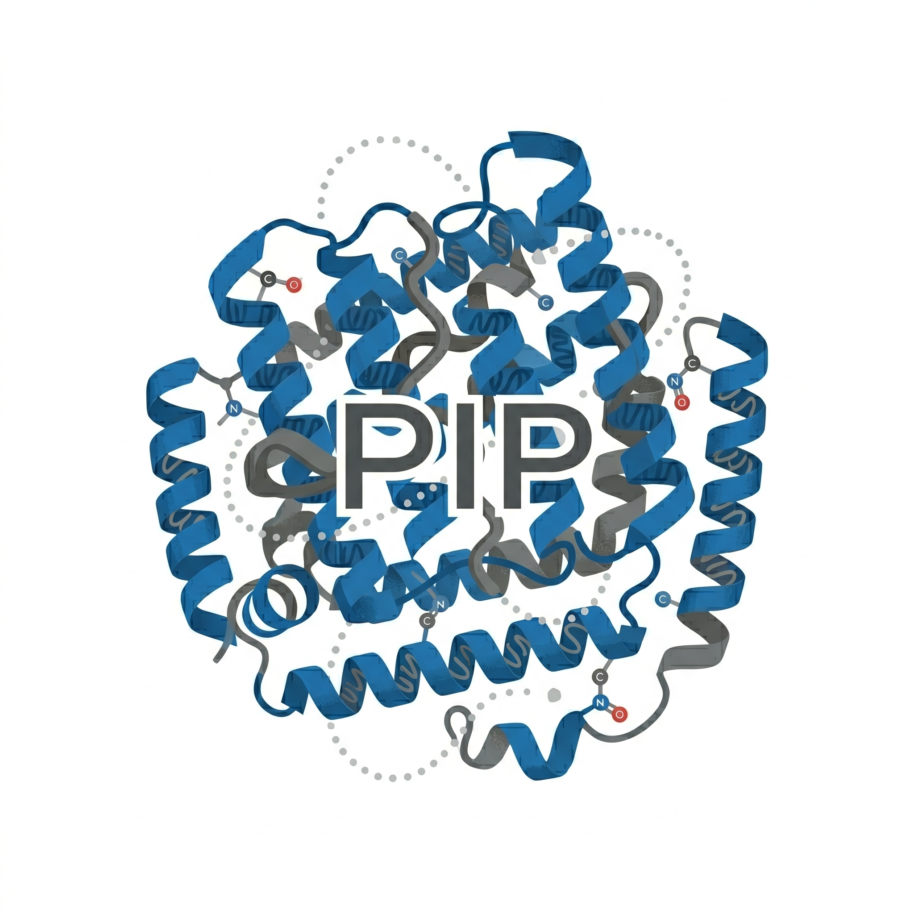

<p align="center">
  
</p>

<h1 align="center">PepIntProt (PIP) v4.0</h1>

<p align="center">
  <b>Peptide–Protein & Protein–Ligand Interaction Profiler from Molecular Dynamics Simulations</b>
</p>

<p align="center">
  <a href="#features">Features</a> •
  <a href="#analyses">Analyses</a> •
  <a href="#installation">Installation</a> •
  <a href="#usage">Usage</a> •
  <a href="#google-colab">Google Colab</a> •
  <a href="#license">License</a>
</p>

[](https://pepintprot.readthedocs.io/en/latest/?badge=latest)

---

## Overview

**PepIntProt (PIP)** is a comprehensive, interactive tool for analyzing Molecular Dynamics (MD) trajectories of peptide–protein complexes, protein–ligand complexes, and APO (single-chain) simulations. It provides 12 publication-ready analyses with automated AI-powered PDF reports.

- **Streamlit web app** — run locally or deploy on [Databricks Apps](https://docs.databricks.com/en/dev-tools/databricks-apps/index.html)
- **Google Colab notebook** — zero-install, run directly in the browser
- **Multi-replica support** — analyze 1–10 independent replicas with cross-replica statistics (mean ± std)
- **6 AI providers** — Databricks, Anthropic, Groq (free), OpenAI, Google Gemini, and Ollama (local) for professional PDF reports with vision support

---

## Features

- **Three system modes**:
  - **Holo (Peptide + Protein)** — peptide–protein complex with auto chain detection
  - **Holo (Protein + Ligand)** — protein–small molecule complex (user specifies ligand residue name)
  - **APO** — single-chain simulation (protein-only / peptide-only)
- **Auto chain detection** — by chainID or residue ID gaps (smallest chain = peptide)
- **Ligand mode** — separates protein and ligand by residue name (e.g., LIG, MOL, JZ4); uses heavy atoms for ligand RMSF/eRMSF
- **12 analyses** with publication-quality plots at 200 dpi + CSV data export
- **Multi-replica** — per-replica results + combined mean ± std analysis
- **AI PDF reports** — 6 providers, 20+ models, markdown-aware rendering with plot embedding
- **Persistent downloads** — `@st.fragment` download buttons that don't trigger page rerun
- **Unicode PDF support** — DejaVu Sans font for full Unicode rendering

---

## Analyses

| # | Analysis | Description | APO | Holo (Peptide) | Holo (Ligand) |
|---|----------|-------------|:---:|:--------------:|:-------------:|
| 1 | **3D Visualization** | Trajectory snapshots, COM trace (3D + XY), conformational overlay | ✓ | ✓ | ✓ |
| 2 | **RMSD** | Root Mean Square Deviation over time | ✓ | ✓ | ✓ |
| 3 | **RMSF** | Root Mean Square Fluctuation per residue/atom (with shadow fill) | ✓ | ✓ | ✓ |
| 4 | **Radius of Gyration** | Compactness over time (Protein / Peptide or Ligand / Complex) | ✓ | ✓ | ✓ |
| 5 | **PCA** | Principal Component Analysis (PC1–PC2 scatter, colored by time) | ✓ | ✓ | ✓ |
| 6 | **DSSP** | Secondary structure evolution (Helix / Strand / Coil heatmaps) | ✓ | ✓ | ✓ (protein only) |
| 7 | **Distance** | Peptide/Ligand–Protein center-of-mass distance | — | ✓ | ✓ |
| 8 | **Contact** | Residue contacts frequency + timeline heatmap | — | ✓ | ✓ |
| 9 | **ProLIF** | Interaction fingerprints (H-bond, hydrophobic, π-stacking, etc.) | — | ✓ | ✓ |
| 10 | **eRMSF** | Ensemble RMSF heatmap (ermsfkit) with boundary line | ✓ | ✓ | ✓ |
| 11 | **Free Energy Landscape** | 2D FEL (RMSD vs Rg) + representative frame PDB extraction | ✓ | ✓ | ✓ |
| 12 | **Interaction Energy** | Coulomb + Lennard-Jones (accurate with parmed or simplified MM) | — | ✓ | ✓ |

### Protein–Ligand Mode Notes

- **RMSF**: Per-atom RMSF for ligand heavy atoms (multiple atoms per residue); per-residue (CA) for protein
- **DSSP**: Protein-only (ligand has no secondary structure)
- **eRMSF**: Per-atom for ligand; boundary line positioned between protein and ligand
- **ProLIF**: Selects ligand directly by residue name for interaction fingerprinting
- **Contact/Distance/Energy**: All use ligand atoms vs protein atoms

---

## Installation

### Local (Streamlit) — recommended

```bash
# Clone
git clone https://github.com/vbonatto11/PepIntProt.git
cd PepIntProt

# Create conda environment (recommended for MDAnalysis)
conda create -n pip_env python=3.12
conda activate pip_env
conda install -c conda-forge mdanalysis mdtraj rdkit prolif

# Install Python dependencies
pip install -r requirements.txt
pip install git+https://github.com/pablo-arantes/ermsfkit.git

# Run
streamlit run app.py --server.port 8000
```

### Google Colab

Open `PepIntProt_Colab.ipynb` in Google Colab — all dependencies are installed automatically. See [Google Colab](#google-colab) section below.

### Databricks Apps

1. Clone this repository into your Databricks workspace under `/Shared/PepIntProt/`
2. The `app.yaml` handles environment setup (miniforge for MDAnalysis/mdtraj/rdkit)
3. Deploy as a Databricks App:
   ```
   databricks apps create pepintprot --source-code-path /Shared/PepIntProt
   ```

---

## Usage

### Required Uploads

| File | Format | Description |
|------|--------|-------------|
| **Topology PDB** | `.pdb` | Single-frame PDB with chain IDs (shared across replicas) |
| **Trajectory** | `.dcd`, `.xtc`, `.trr`, `.nc`, `.pdb` | MD trajectory (one per replica) |

### Optional Uploads

| File | Format | Description |
|------|--------|-------------|
| ProLIF topology | `.pdb`, `.mol2`, `.tpr`, `.top`, `.prmtop`, `.psf` | PDB with hydrogens + element column (for ProLIF) |
| FF Topology | `.prmtop`, `.top`, `.pdb` | Force field parameters (for accurate Interaction Energy) |

### Workflow

1. Select system type:
   - **Holo (Peptide + Protein)** — peptide–protein complex with auto chain detection
   - **Holo (Protein + Ligand)** — protein–small molecule complex (enter ligand residue name, e.g., LIG, MOL, JZ4)
   - **APO Protein** or **APO Peptide** — single-chain simulation
2. Define number of replicas (1–10)
3. Upload topology PDB (shared) + per-replica trajectories
4. Configure analysis parameters (cutoffs, temperature, etc.)
5. Select analyses to run
6. Choose AI model for report generation
7. Click **🚀 Run Analysis**
8. Download per-replica ZIPs + combined report

---

## Multi-Replica Analysis

When using > 1 replica:

- Each replica is analyzed independently with its own report and ZIP
- **Combined analysis** computes mean ± std across replicas for all metrics
- Combined plots show individual replica traces as thin lines + mean ± std envelope
- Combined AI report discusses reproducibility and inter-replica variability
- **Master ZIP** contains all replica results + combined analysis

---

## AI Report Models

### Cloud Providers

| Model | Provider | Vision | Auth | Notes |
|-------|----------|:------:|------|-------|
| Claude Opus 4.7 | Databricks | ✓ | Workspace | Best quality |
| Claude Opus 4.6 | Databricks | ✓ | Workspace | |
| Claude Sonnet 4.5 | Databricks | ✓ | Workspace | Good speed/quality balance |
| Claude Haiku 4.5 | Databricks | ✓ | Workspace | Fastest Databricks option |
| Qwen3-Next 80B | Databricks | — | Workspace | Free tier |
| Claude Opus 4 | Anthropic | ✓ | API key | |
| Claude Sonnet 4 | Anthropic | ✓ | API key | |
| LLaMA 4 Scout 17B | Groq | ✓ | API key | **Free** |
| LLaMA 3.3 70B | Groq | — | API key | **Free** |
| LLaMA 3.1 8B Instant | Groq | — | API key | **Free**, fastest |
| Gemma 2 9B | Groq | — | API key | **Free** |
| GPT-4.1 | OpenAI | ✓ | API key | |
| GPT-4.1 Mini | OpenAI | ✓ | API key | Cost-efficient |
| GPT-4o | OpenAI | ✓ | API key | |
| o3 Mini | OpenAI | — | API key | Reasoning |
| Gemini 2.5 Pro | Google | ✓ | API key | |
| Gemini 2.5 Flash | Google | ✓ | API key | Fast |
| Gemini 2.0 Flash | Google | ✓ | API key | Fastest Gemini |

### Local Models (Ollama)

| Model | Vision | Notes |
|-------|:------:|-------|
| Qwen3.5 7B | — | Lightweight, fast |
| LLaMA 3.3 70B | — | High quality |
| DeepSeek R1 32B | — | Reasoning |
| Gemma 3 27B | ✓ | Vision support |

> **Note:** Ollama models require a local Ollama server (`ollama serve`). Not available in Google Colab or Databricks Apps.

---

## Google Colab

The `PepIntProt_Colab.ipynb` notebook provides the same analyses in a Google Colab environment:

- All code cells are **hidden by default** — only configuration forms are visible
- Dependencies are installed automatically
- File upload/download uses Google Colab's native interface
- AI report supports Groq (free), OpenAI, Google Gemini, and Anthropic (API key required)
- Works with free Colab tier (no GPU required)

[](https://colab.research.google.com/github/vbonatto11/PepIntProt/blob/main/PepIntProt_Colab.ipynb)

---

## File Structure

```
PepIntProt/
├── app.py                    # Main Streamlit application (3500+ lines)
├── app.yaml                  # Databricks Apps deployment config
├── requirements.txt          # Python dependencies
├── logov1.png                # PepIntProt logo
├── PepIntProt_Colab.ipynb    # Google Colab notebook
├── README.md                 # This file
└── LICENSE                   # MIT License
```

---

## Dependencies

**Core**: streamlit, numpy, pandas, matplotlib, seaborn, scipy

**MD Analysis**: MDAnalysis, mdtraj, prolif, ermsfkit (GitHub)

**Force Field**: parmed (optional, for accurate interaction energy)

**PDF**: fpdf2

**LLM**: anthropic, groq, google-generativeai, openai, databricks-sdk[openai], requests

---

## Citation

If you use PepIntProt in your research, please cite:

```bibtex
@software{pepintprot2025,
  title = {PepIntProt (PIP): Peptide-Protein Interaction Profiler from Molecular Dynamics Simulations},
  year = {2025},
  url = {https://github.com/vbonatto11/PepIntProt}
}
```

### Related Tools

- [ermsfkit](https://github.com/pablo-arantes/ermsfkit) — Ensemble RMSF calculation
- [ProLIF](https://github.com/chemosim-lab/ProLIF) — Protein-Ligand Interaction Fingerprints
- [MDAnalysis](https://www.mdanalysis.org/) — MD trajectory analysis
- [mdtraj](https://www.mdtraj.org/) — DSSP and trajectory manipulation

---

## License

This project is licensed under the MIT License — see the [LICENSE](LICENSE) file for details.

---

<p align="center">
  
  <br>
  <i>PepIntProt (PIP) v4.0 — Peptide–Protein & Protein–Ligand Interaction Profiler</i>
</p>
